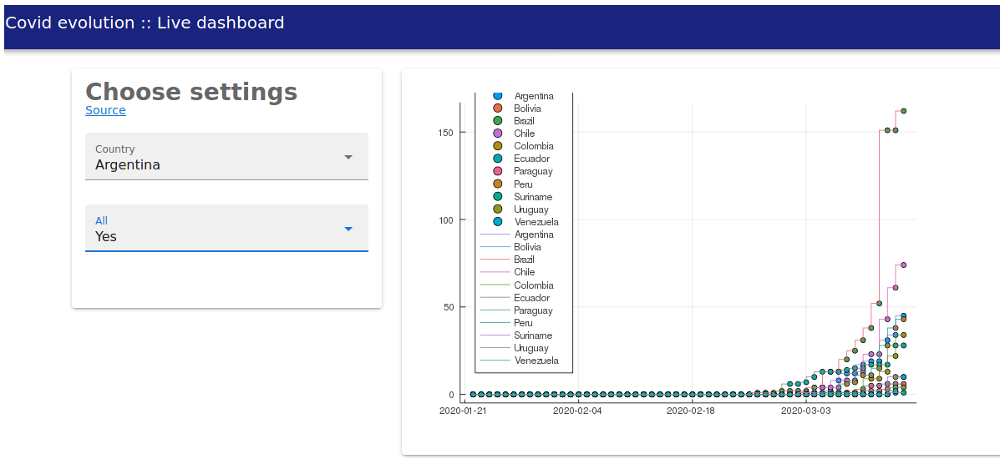

# COVID Dashboard  \

Julia dashboard following exponential growth for Coronavirus (COVID-19) new cases.  
Our goal is to examine countries with steepest curves.

R script `data/data-wrang.R` downloads and formats data taken from John's Jopkins compilation [here](https://github.com/CSSEGISandData/COVID-19) and outputs to `data/covid-long16Mar.csv` which is later used by the [Matte.jl](https://github.com/angusmoore/Matte.jl/) dashboard defined in `app.jl`.  

### Run

```julia
~$git clone https://github.com/fargolo/covid-dash.git
Cloning into 'covid-dash'...
remote: Enumerating objects: 16, done.
(...)
~$julia
julia>cd("covid-dash")
```
Enter the Pkg REPL by pressing "]":
```julia
(v1.3) pkg> activate .
Activating environment at `~/covid-dash/Project.toml`
(covid-dash)pkg> instantiate 
julia> using Matte
julia> using Revise
julia> includet("app.jl")
julia> run_app(CovidDash)
Web Sockets server running at 127.0.0.1:8001 
Web Server starting at http://127.0.0.1:8000 
Web Server running at http://127.0.0.1:8000 
```
  

# To do 
*  Run regression with parameters defined after countries.  
*  Rank countries according to growth rate.  
